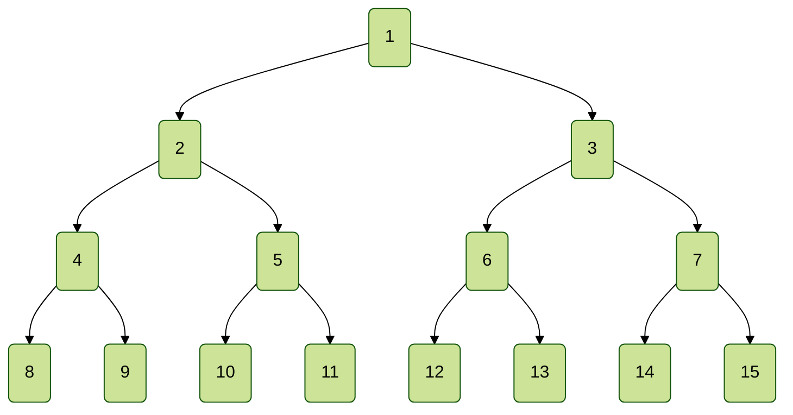
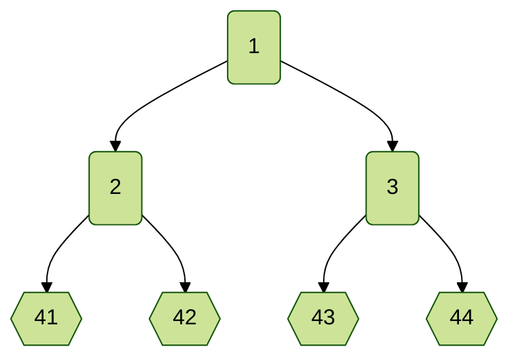
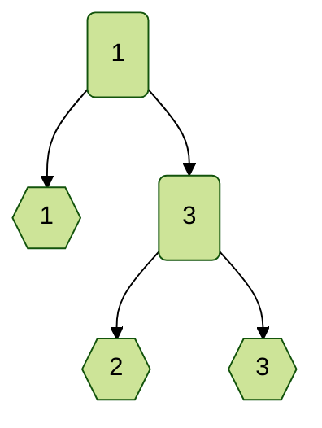
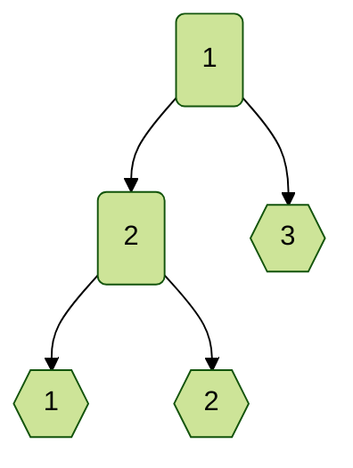
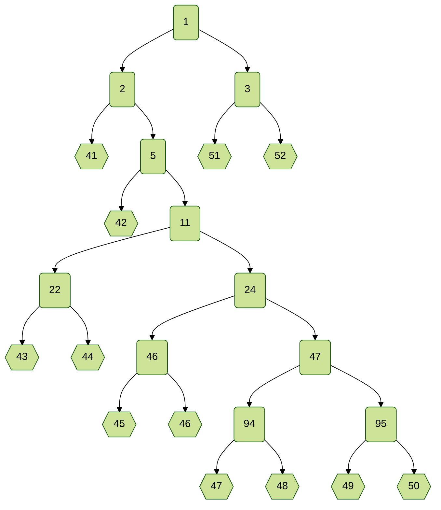
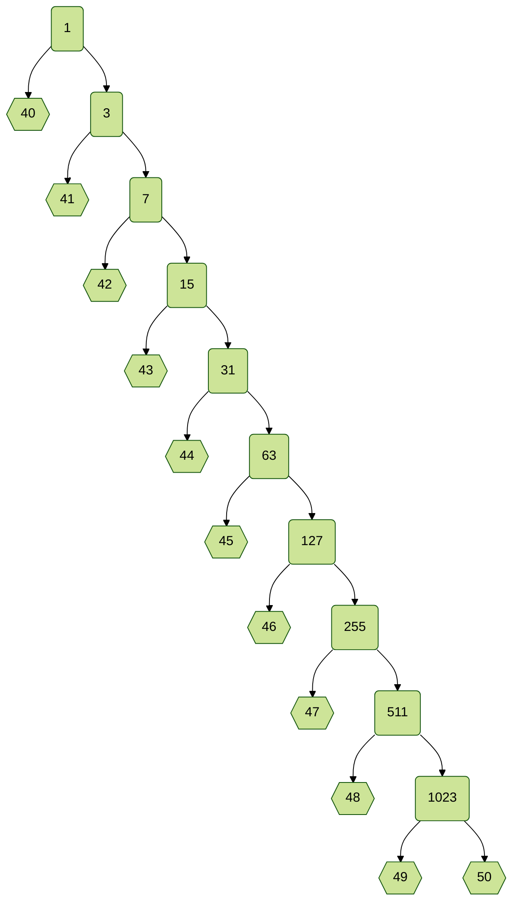

+++
title = "Nockmas 2025: Day 1"
date = "2025-12-09"
description = "12 days of Nockmas: Address, opcode 0"
# aliases = []

[extra]
# author = ""
ship = "~lagrev-nocfep"
image = "https://s3.us-east-1.amazonaws.com/urbit.orgcontent/Blog/Blog_Building+on+Urbit_Social+16x9.png"
# imageCard = "https://s3.us-east-1.amazonaws.com/urbit.orgcontent/Blog/Blog_Building+on+Urbit_Social+16x9.png"
# imageIndex = "https://s3.us-east-1.amazonaws.com/urbit.orgcontent/Blog/Blog_Building+on+Urbit_Tall+Banner.png"
# imageDark =
# imageCardDark =
# imageIndexDark =
tags =  ["nock", "nockmas", ""]
+++

# Opcode 0: Address

## Syntax

Opcode 0 implements the idiomatic `/` fas slot operator, which retrieves a noun at a specified address within the subject.

```nock
*[a 0 b]            /[b a]
```

Before discussing opcode 0, the addressing operator, we need to explore how nouns are structured in Nock.

## Nouns

The fundamental data structure of Nock is the noun, which is either an atom (a non-negative integer) or a cell (an ordered pair of two nouns).  Nouns can be visualized as [binary trees](https://grokipedia.com/page/Binary_tree), in which atoms are leaves and cells are internal nodes.

This leads to a convenient addressing scheme for nouns, for which each noun and sub-noun can be assigned a unique address based on its position in the binary tree. The addressing scheme works as follows:

```nock
/[1 a]              a
/[2 a b]            a
/[3 a b]            b
/[(a + a) b]        /[2 /[a b]]
/[(a + a + 1) b]    /[3 /[a b]]
/a                  /a
```



That is, the left-hand daughter of a cell is addressed by doubling its mother's address, while the right-hand daughter is addressed by doubling its mother's address and adding one. The root of the tree is always at address 1.

Of course, that's just an addressing scheme:  it tells you how a noun is laid out, but not which positions are actually occupied.  Let's see some examples.  In these, we will use `⬡` to denote atoms (leaves) and `▢` to denote cells (internal nodes).

### `[[41 42] [43 44]]`



### `[1 [2 3]]`



```nock
[a b c]             [a [b c]]
```

We often omit the right-hand cells since cells tend to branch strongly right in practice.  (This saves us from Lisp-style end-paren piles.)

```nock
[a b c]             [a [b c]]
```

Thus, `[1 [2 3]]` can be written equivalently as `[1 2 3]`.

### `[[1 2] 3]`



## Syntax (Redux)

```nock
/[1 a]              a
/[2 a b]            a
/[3 a b]            b
/[(a + a) b]        /[2 /[a b]]
/[(a + a + 1) b]    /[3 /[a b]]
/a                  /a

*[a 0 b]            /[b a]
```

## Explanation

The `/` fas or slot operator describes how to navigate a noun given an address as an atom.  The address is interpreted as a path through the binary tree, starting at the root (address 1).  Each even number indicates a left branch, and each odd number indicates a right branch.  The process continues until the address 1 is reached, at which point the corresponding noun is returned.

Most of the time, we expand the tree out to the conceptual binary tree map above rather than recursively apply the `/` fas slot rule.

Opcode 0 is used to retrieve the noun at address `b` within the subject.  `b` must be a positive atom (the address).

Opcode 0 crashes if the address doesn't exist (e.g., addressing into an atom).  Since there is no address 0, we use `/[0 a]` or `[a 0 0]` to denote a crash.

### Binary

Addressing becomes particularly easy to read in binary form, in which a 0 bit corresponds to a left branch and a 1 bit corresponds to a right branch.  We ignore the first bit ($1$, the root) and read the path in binary:

* $7_{10} = 111_2 \rightarrow \text{RRR}$.
* $5_{10} = 101_2 \rightarrow \text{RLR}$.
* $4_{10} = 100_2 \rightarrow \text{RLL}$.

You will notice other patterns, e.g., that the rightmost child at a particular level is equal to a power of 2 minus 1.

## Examples



```nock
:subject [[[41 42 [43 44] [45 46] [47 48] [49 50]]] [51 52]]
```

**Output:**
```
Subject set to: [[41 42 [43 44] [45 46] [47 48] 49 50] 51 52]
```

```nock
[0 2]
```

**Output:**
```
[41 42 [43 44] [45 46] [47 48] 49 50]
```

```nock
[0 3]
```

**Output:**
```
[51 52]
```

```nock
[0 11]
```

**Output:**
```
[[43 44] [45 46] [47 48] 49 50]
```

```nock
[0 47]
```

**Output:**
```
[[47 48] 49 50]
```

```nock
[0 94]
```

**Output:**
```
[47 48]
```

```nock
[0 95]
```

**Output:**
```
[49 50]
```



```nock
:subject [40 41 42 43 44 45 46 47 48 49 50]
```

**Output:**
```
Subject set to: [40 41 42 43 44 45 46 47 48 49 50]
```

```nock
[0 2]
```

**Output:**
```
40
```

```nock
[0 6]
```

**Output:**
```
41
```

```nock
[0 2047]
```

**Output:**
```
50
```
